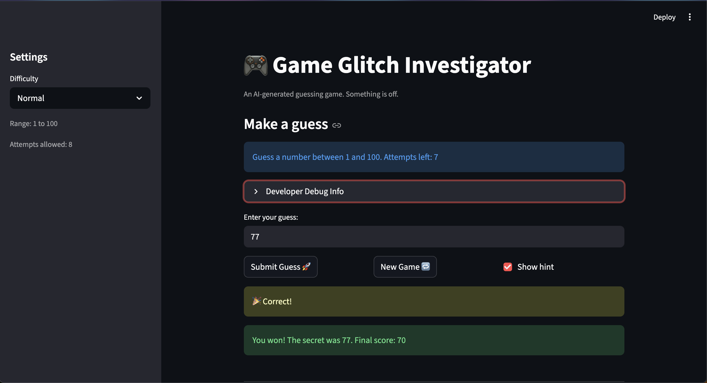

# 🎮 Game Glitch Investigator: The Impossible Guesser

## 🚨 The Situation

You asked an AI to build a simple "Number Guessing Game" using Streamlit.
It wrote the code, ran away, and now the game is unplayable. 

- You can't win.
- The hints lie to you.
- The secret number seems to have commitment issues.

## 🛠️ Setup

1. Install dependencies: `pip install -r requirements.txt`
2. Run the broken app: `python -m streamlit run app.py`

## 🕵️‍♂️ Your Mission

1. **Play the game.** Open the "Developer Debug Info" tab in the app to see the secret number. Try to win.
2. **Find the State Bug.** Why does the secret number change every time you click "Submit"? Ask ChatGPT: *"How do I keep a variable from resetting in Streamlit when I click a button?"*
3. **Fix the Logic.** The hints ("Higher/Lower") are wrong. Fix them.
4. **Refactor & Test.** - Move the logic into `logic_utils.py`.
   - Run `pytest` in your terminal.
   - Keep fixing until all tests pass!

## 📝 Document Your Experience

- [x] Describe the game's purpose.  
The game is a number guessing game where the user has to guess a secret number. There are different levels (Easy, Normal, Hard). On every try the game either says the answer is correct if the guess is the same as the secret, or hints (Too High or Too low). There are a limited number of attemps and the score is absed on how amny attempts the user took to get to the correct answer. 
- [x] Detail which bugs you found.  
1) The check_guess had the hints reversed. When the guess was too high it said "Go Higher" and when too low it said "Go Lower", which made no sense and was counterintuitive.  
2) The get_range_for_difficulty function returned a range of 1-50 for Hard mode, which is actually easier than Normal mode's range (1-100) since its narrower.  
3) The new game block only reset attempts and secret, but left status, score, and history unchanged. Since the status stayed as "won" or "lost", the game ws not able to restart.  
4) The update_score function awarded +5 points on even-numbered attempts when the guess was too high, instead of deducting points
- [x] Explain what fixes you applied.  
1) Swapped the hint messages so "Too High" now says "Go Lower" and "Too Low" now says "Go Higher". Also refactored this into logic_utils.py. 
2) Changed the hard difficulty range from 1-50 to 1-200 so it is actually harder than Normal (1-100). 
3) Added status, score, and history resets to the new_game block so the game fully restarts when the button is clicked.

## 📸 Demo

-  

## 🚀 Stretch Features

- [ ] [If you choose to complete Challenge 4, insert a screenshot of your Enhanced Game UI here]
